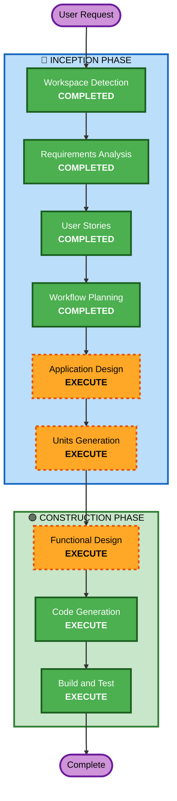

# Execution Plan

## Detailed Analysis Summary

### Change Impact Assessment
- **User-facing changes**: Yes - 고객 주문 UI + 관리자 대시보드 신규 구축
- **Structural changes**: Yes - 전체 시스템 아키텍처 신규 설계
- **Data model changes**: Yes - 매장, 테이블, 메뉴, 주문 데이터 모델 신규
- **API changes**: Yes - REST API 전체 신규 설계
- **NFR impact**: No - 소규모 로컬 환경, 별도 NFR 설계 불필요

### Risk Assessment
- **Risk Level**: Low (소규모, 로컬 환경, 프로토타입 수준)
- **Rollback Complexity**: Easy (Greenfield, 롤백 불필요)
- **Testing Complexity**: Moderate (다수 API + 실시간 SSE)

---

## Workflow Visualization

---

## Phases to Execute

### 🔵 INCEPTION PHASE
- [x] Workspace Detection (COMPLETED)
- [x] Requirements Analysis (COMPLETED)
- [x] User Stories (COMPLETED)
- [x] Workflow Planning (COMPLETED)
- [ ] Application Design - **EXECUTE**
  - **Rationale**: 신규 프로젝트로 컴포넌트 구조, API 설계, 데이터 모델 정의 필요
- [ ] Units Generation - **EXECUTE**
  - **Rationale**: 백엔드 + 프론트엔드 2개 = 3개 모듈로 분해 필요

### 🟢 CONSTRUCTION PHASE
- [ ] Functional Design - **EXECUTE**
  - **Rationale**: 데이터 모델, API 엔드포인트, 비즈니스 로직 상세 설계 필요
- [ ] NFR Requirements - **SKIP**
  - **Rationale**: 소규모 로컬 환경, 별도 NFR 설계 불필요
- [ ] NFR Design - **SKIP**
  - **Rationale**: NFR Requirements 스킵으로 인해 스킵
- [ ] Infrastructure Design - **SKIP**
  - **Rationale**: 로컬 실행 환경, 인프라 설계 불필요
- [ ] Code Generation - **EXECUTE** (ALWAYS)
  - **Rationale**: 실제 코드 구현
- [ ] Build and Test - **EXECUTE** (ALWAYS)
  - **Rationale**: 빌드 및 테스트 지침 생성

### 🟡 OPERATIONS PHASE
- [ ] Operations - PLACEHOLDER

---

## Success Criteria
- **Primary Goal**: 소규모 매장에서 동작하는 테이블오더 MVP 완성
- **Key Deliverables**:
  - Express 백엔드 API 서버 (SQLite + SSE)
  - React 고객용 주문 앱
  - React 관리자용 대시보드 앱
  - 테스트 코드
- **Quality Gates**:
  - 모든 API 엔드포인트 동작 확인
  - 고객 주문 플로우 E2E 동작
  - 관리자 실시간 모니터링 동작
  - 테스트 통과
